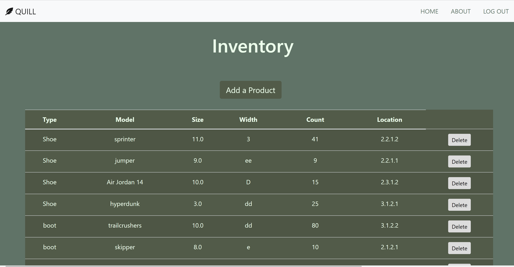

# Project 2 - Inventory Management System
## Overview
Team project.

The goal of this project is to develop a system useful for managing inventory in a commercial setting. The application is intended for use by employees only. 
## Links to Repos
[GitHub Repo](https://github.com/samanthapre/Project2_inventoryManagement)

[Heroku Deployment](https://bc-project2.herokuapp.com/)

## Features
- Sign-in for security
- List all products (the inventory)
- Add a new product
- Delete a product
- Get currenty quantity (count) of all products
- Get location of products

### Future possible features
- Reorder point
- Find product based on features such as model and/or size

## Technologies
- HTML/CSS/JavaScript
- MVC Architecture
- Bootstrap
- Node
- Express
- Sequelize 
- MySQL
- SHA256
- Font Awesome

## Screenshots

Landing Page

Sign-up Modal

Inventory Page

Add Product Modal

